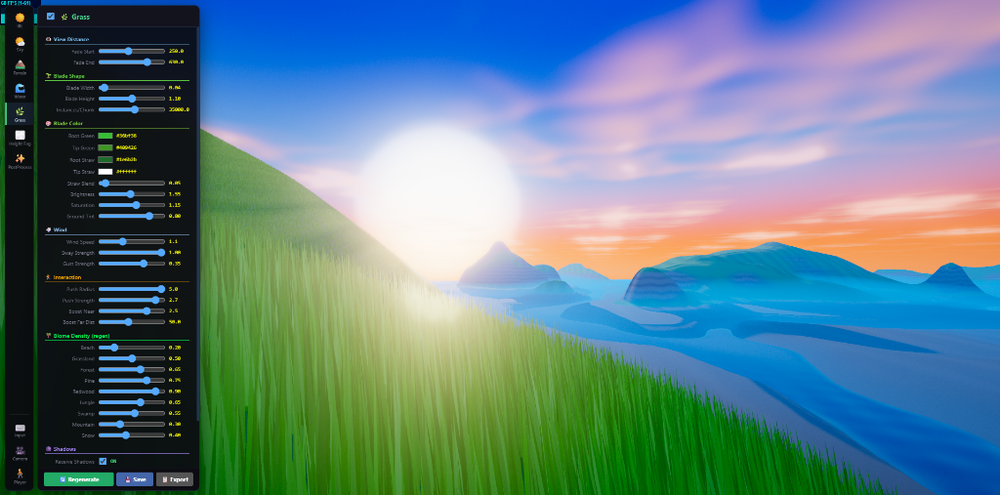

# 🌍 WebGPU Terrain Engine



A modular, plugin-driven procedural terrain engine built on **Three.js r184 WebGPU** and **Vite**. It generates massive open-world landscapes entirely on the GPU using native WebGPU compute shaders, with real-time TSL (Three Shading Language) vertex displacement, procedural biome classification, dynamic water, foliage instancing, and atmospheric rendering — all running in the browser.

> **Status:** Active development · Requires a WebGPU-capable browser (Chrome 113+, Edge 113+, or Firefox Nightly with `dom.webgpu.enabled`).

---

## ✨ Features

| Category | Details |
|---|---|
| **Terrain** | 8 km² continuous heightfield with QuadTree LOD (7 levels), GPU compute displacement, procedural biomes, river carving, terracing, and cliff generation |
| **Procedural Generation** | Graph-based Delaunay triangulation pipeline with domain-warped island shapes, ridged multifractal mountains, and configurable river networks |
| **Water** | Infinite ocean plane with dual scrolling normal maps, depth-based shoreline foam, and PBR reflections |
| **Vegetation** | High-density grass via `InstancedMesh` pools driven by the QuadTree, with TSL wind animation, player interaction push, and biome-aware density |
| **Sky & Lighting** | Procedural Rayleigh/Mie atmospheric scattering, dynamic sun positioning, real-time PMREM environment baking |
| **Post-Processing** | Native WebGPU Bloom, ACES Filmic tone mapping, and color grading |
| **Fog** | Height-based volumetric fog with procedural noise for rolling mist |
| **Player** | First-person controller with pointer lock, WASD movement, and terrain-clamped physics |
| **Debug UI** | Full settings panel (Ctrl+F9) for live parameter tweaking with localStorage persistence |

---

## 🚀 Quick Start

### Prerequisites

- **Node.js** ≥ 18
- A **WebGPU-capable browser** (Chrome/Edge 113+ recommended)

### Install & Run

```bash
git clone https://github.com/YOUR_USERNAME/WebGPUPlugins.git
cd WebGPUPlugins
npm install
npm run dev
```

Open `http://localhost:5174` in your browser. Press **Ctrl+F9** to toggle the Debug UI.

### Build for Production

```bash
npm run build
npm run preview
```

---

## 🏗️ Architecture

The engine uses a **Plugin Manager** pattern. A lightweight core provides the Three.js renderer, scene, and camera; all features are implemented as self-contained plugins that register into a shared lifecycle.

```
┌─────────────────────────────────────────────────┐
│                   main.ts                       │
│  WebGPURenderer · Scene · Camera · Clock        │
└────────────────────┬────────────────────────────┘
                     │ register / initAll / updateAll
              ┌──────▼──────┐
              │PluginManager│
              └──────┬──────┘
    ┌────────┬───────┼───────┬────────┬───────┐
    ▼        ▼       ▼       ▼        ▼       ▼
 DebugUI   Sky    Terrain  Water   Grass  PostProcess
           IBL    ├─GPUCompute       HeightFog
                  ├─QuadTreeLOD      Player
                  └─GraphGenerator   Camera/Input
```

### Plugin Lifecycle

| Phase | Method | Description |
|---|---|---|
| **Register** | `register(name, plugin)` | Injects `core` dependencies and adds the plugin to the map |
| **Init** | `await plugin.init()` | One-time async setup (GPU pipelines, textures, UI registration) |
| **Update** | `plugin.update(dt)` | Per-frame logic; skipped if the plugin is disabled via the UI |
| **Dispose** | `plugin.dispose()` | Cleanup GPU resources and DOM elements |

### GPU Pipeline

The terrain data flows through three sequential WebGPU compute passes:

```
GraphGenerator (CPU)        GPUCompute (GPU)                 QuadTreeLOD (Render)
─────────────────────────────────────────────────────────────────────────────────
Delaunay graph        ──►  height.compute.wgsl  ──►  TSL vertex displacement
 + river routing            biome.compute.wgsl       (heightTex → world Y)
 + rasterization            spawn.compute.wgsl       TSL fragment coloring
                                                      (biomeTex → material)
```

---

## 📁 Project Structure

```
WebGPUPlugins/
├── public/                     # Static assets
│   ├── heightmap.png           # Default heightmap (used in image mode)
│   └── heightmap_rivers.png    # River overlay map
├── src/
│   ├── main.ts                 # Entry point — boots renderer & PluginManager
│   ├── core/
│   │   ├── PluginManager.ts    # Plugin lifecycle orchestrator
│   │   ├── CameraManager.ts    # Camera state & cinematic modes
│   │   └── InputController.ts  # Raw keyboard/mouse event normalizer
│   ├── plugins/
│   │   ├── DebugUIPlugin.ts    # Settings panel & parameter persistence
│   │   ├── TerrainPlugin.ts    # Terrain init, UI bindings, rebuild triggers
│   │   ├── GrassPlugin.ts      # Instanced grass with wind & biome density
│   │   ├── WaterPlugin.ts      # Infinite ocean with shoreline foam
│   │   ├── SkyPlugin.ts        # Procedural atmosphere & sun/moon
│   │   ├── IBLPlugin.ts        # Dynamic PMREM environment baking
│   │   ├── HeightFogPlugin.ts  # Volumetric height fog with noise
│   │   ├── PostProcessPlugin.ts# Bloom & tone mapping
│   │   ├── PlayerControllerPlugin.ts # FPS movement & terrain clamping
│   │   ├── CameraPlugin.ts     # Camera orbit & follow modes
│   │   └── InputPlugin.ts      # Input state forwarding to PluginManager
│   ├── systems/
│   │   ├── TerrainSystem.js    # Orchestrates GPU compute + QuadTree + TSL material
│   │   ├── GPUCompute.js       # Native WebGPU compute pipeline manager
│   │   ├── QuadTreeLOD.js      # Camera-driven quadtree subdivision & mesh pooling
│   │   └── GraphGenerator.js   # CPU-side Delaunay graph + river routing + rasterizer
│   ├── gpu/
│   │   ├── height.compute.wgsl # Heightfield generation (FBM, terracing, river carving)
│   │   ├── biome.compute.wgsl  # Biome classification from height/slope/moisture
│   │   └── spawn.compute.wgsl  # Foliage spawn density evaluation
│   └── data/
│       └── CameraDB.ts         # Camera preset definitions
├── package.json
├── tsconfig.json
└── index.html
```

---

## 🔌 Plugins

### Terrain

The terrain pipeline supports two generation modes:

- **Image Mode (default):** Loads `heightmap.png` and `heightmap_rivers.png` from `public/`, uploads them to the GPU, and processes them through the compute shaders.
- **Procedural Mode (Delaunay):** Generates terrain entirely from math using a graph-based pipeline inspired by [Florian Hoenig's workflow](https://x.com/rianflo/status/2037606948607299810) and [Red Blob Games' polygonal maps](https://www.redblobgames.com/maps/terrain-from-noise/).

The procedural pipeline offers these UI-exposed parameters:

| Parameter | Description |
|---|---|
| Island Size | Radius of the landmass before dropping to ocean |
| Noise Scale | Frequency of macro mountain features |
| Noise Height | Amplitude of the ridged mountain noise |
| Mountains | Coverage ratio — how much of the island is mountainous |
| Hills Height | Amplitude of rolling hills in lowland areas |
| Random Seed | Deterministic seed for reproducible generation |

### Grass

Uses object-pooled `InstancedMesh` groups that attach to QuadTree leaf chunks. The TSL shader handles per-blade wind sway, gust variation, player proximity push, and biome-aware density/coloring. Biome density is configurable per-biome (Beach, Grassland, Forest, Pine, Redwood, Jungle, Swamp, Mountain, Snow).

### Water

An infinite `PlaneGeometry` tracks the camera and uses dual scrolling normal maps for wave animation. Depth-based shoreline foam is calculated by comparing the fragment depth against the scene depth buffer.

### Sky & IBL

`SkyPlugin` drives a procedural atmosphere (Rayleigh + Mie scattering). `IBLPlugin` bakes the sky into a PMREM cubemap on-demand when the sun position changes significantly, ensuring all PBR materials receive accurate ambient lighting and reflections.

### Height Fog

Applies volumetric fog below a configurable altitude threshold, with procedural noise domain warping to create rolling mist banks that animate over time.

### Post-Processing

Intercepts the render loop to apply WebGPU-native Bloom and ACES Filmic tone mapping via Three.js's node-based post-processing system.

---

## ⌨️ Controls

| Key | Action |
|---|---|
| **W/A/S/D** | Move forward / left / backward / right |
| **Mouse** | Look around (pointer lock) |
| **Shift** | Sprint |
| **Space** | Jump |
| **Ctrl+F9** | Toggle Debug UI |

---

## 🛠️ Tech Stack

| Technology | Purpose |
|---|---|
| [Three.js r184](https://threejs.org/) | WebGPU renderer, scene graph, TSL shading |
| [Vite 8](https://vite.dev/) | Dev server & build tooling |
| [TypeScript 6](https://www.typescriptlang.org/) | Type safety for plugins and core |
| [Delaunator](https://github.com/mapbox/delaunator) | Fast 2D Delaunay triangulation for graph generation |
| Native WebGPU | Compute shaders (WGSL) for terrain/biome/spawn |

---

## 📄 License

[MIT](LICENSE)

---

## 🙏 Acknowledgements

- [Florian Hoenig (@rianflo)](https://x.com/rianflo) — Graph-based terrain generation workflow inspiration
- [Red Blob Games](https://www.redblobgames.com/) — Polygonal map generation concepts
- [Three.js Team](https://threejs.org/) — WebGPU renderer and TSL shading language
- [Mapbox/Delaunator](https://github.com/mapbox/delaunator) — Blazing fast Delaunay triangulation
